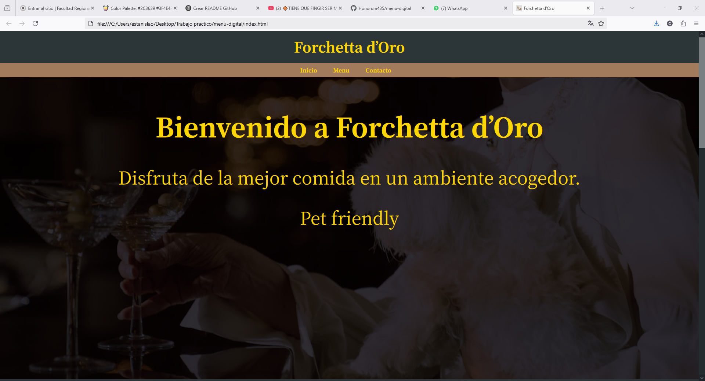

# Forchetta d’Oro

🌟 Bienvenido a **Forchetta d’Oro**, un restaurante pet-friendly que ofrece la mejor comida en un ambiente acogedor y moderno.

📍 **Ubicación:** Argentina  
👤 **Autor:** [Honorum435](https://github.com/Honorum435)

---

## 🖼️ Vista previa

### Página de inicio


### Menú digital


---

## 🚀 ¿Qué es este proyecto?

Este sitio web representa un menú digital para el restaurante *Forchetta d’Oro*. Está dividido en dos secciones principales:

- Una página de bienvenida con diseño elegante.
- Una carta visual con imágenes y precios de comidas y bebidas.

Ideal para mostrar en tablets, códigos QR o como presentación digital del restaurante.

---

## 🛠️ Tecnologías usadas

- HTML5
- CSS3

---

## 🔗 Ver online

👉 [https://honorum435.github.io/menu-digital/](https://honorum435.github.io/menu-digital/)

---

## 📦 Cómo usar localmente

```bash
# Cloná el repositorio
git clone https://github.com/Honorum435/menu-digital.git
cd menu-digital

# Abrí el archivo principal
start index.html  # En Windows
open index.html   # En macOS
